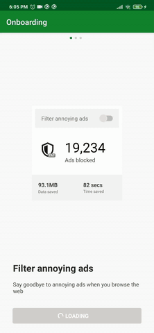

# Onboarding created by [MotionLayout](https://developer.android.com/reference/androidx/constraintlayout/motion/widget/MotionLayout)

MotionLayout is a new class available in the ConstraintLayout 2.0 library to help Android developers manage motion and widget animation in their application.

[Tutorial](https://developer.android.com/training/constraint-layout/motionlayout) by Google.

Screenshot:

